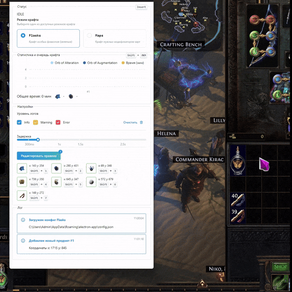

# Path of Exile Craft

> [!WARNING]  
>  Использование такого рода ПО является нарушением политики игры, вы можете получить бан.


Бот для автоматического крафта в игре Path of Exile

Проект создавался для личного использования и имеет очень ограниченный функционал, можно использовать как шаблон и доработать под свой вид крафта

# Описание возможностей и особенностей



- Крафт утилити фласок
- Крафт т16 / т17 карт
- Поддерживается только на клиенте с английским языком
- Легко доработать под другой вид крафта

## Использование

Для установки и запуска проекта, необходим [NodeJS](https://nodejs.org/) v20+

Установите зависимости с помощью команды:

```sh
npm install
```

Для запуска бота:

```sh
npm run dev
```

## FAQ

### Как быстро получить список суффиксов и префиксов для другой базы?

Переходим на https://www.craftofexile.com/, выбираем нужную базу, открываем консоль и вводим для префиксов:
```js
[...document.querySelectorAll('.prefixes .main .label')].map(x => x.children[0].childNodes[0].textContent)
```
и для суффиксов по аналогии:
```js
[...document.querySelectorAll('.suffixes .main .label')].map(x => x.children[0].childNodes[0].textContent)
```
